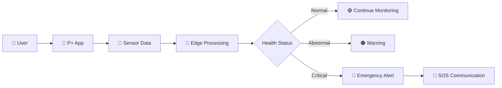

<div align="center">

# 🧬 P+

### **PERSONAL HEALTH • REAL-TIME • INTELLIGENT • PRIVATE**


<br>


<br><br>

[](https://github.com/ts042049-cpu/P-PLUS)
[](#)
[](#)
[](#)

</div>

---

# 🧠 What is P+?

**P+** is a privacy-first **Personal Health Companion** designed to continuously understand important health signals and help users recognize potential risks before they become serious.

Instead of depending completely on cloud-based AI services, P+ is designed around a **local-first architecture**, smart sensors and edge intelligence.

> **Sense → Understand → Alert → Protect**

---

<div align="center">

## ⚡ THE P+ PHILOSOPHY

```text
        ┌─────────────────┐
        │     SENSORS     │
        │ ❤️ HR  🫁 SpO2  │
        │ 📐 POSTURE       │
        └────────┬────────┘
                 │
                 ▼
        ┌─────────────────┐
        │   EDGE DEVICE   │
        │   ESP32 / MCU   │
        └────────┬────────┘
                 │
                 ▼
        ┌─────────────────┐
        │   LOCAL AI/ML   │
        │  TinyML Models  │
        └────────┬────────┘
                 │
          ┌──────┴──────┐
          ▼             ▼
     🟢 NORMAL       🔴 ALERT
          │             │
          ▼             ▼
      Dashboard      SOS / Warning
```

</div>

---

# 🚀 Why P+?

<table>
<tr>
<td width="50%">

### 🔐 Privacy First
Health data should belong to the user.

### ⚡ Real-Time Monitoring
Important health signals can be monitored continuously.

### 🧠 Edge Intelligence
AI/ML processing can happen close to the device.

</td>

<td width="50%">

### 📡 Offline Ready
Designed for environments where cloud connectivity is unreliable.

### 🧍 Posture Intelligence
Detect prolonged unhealthy posture and generate alerts.

### 🚨 Early Warning
Identify abnormal patterns and provide timely notifications.

</td>
</tr>
</table>

---

# 🧬 Core Features

### ❤️ Vital Monitoring
Monitor health parameters such as:

- Heart Rate
- SpO₂
- Activity
- Posture
- Safety indicators

### 🧍 Smart Posture Detection

P+ can detect prolonged forward posture.

Example configuration:

```text
Posture Angle: 15°
Duration:      10 sec
       ↓
Posture Detected
       ↓
Local Processing
       ↓
⚠️ Slouch Alert
       ↓
User Notification
```

The threshold can be configured according to the user's profile.

### 🧠 Edge AI

The architecture is designed for:

```text
Sensor Data
     ↓
Feature Extraction
     ↓
Quantized ML Model
     ↓
Local Inference
     ↓
Risk Classification
```

### 🚨 Emergency Communication

The system is designed with **offline BLE / mesh communication** in mind so that safety communication does not have to depend entirely on internet connectivity.

---

# 🏗️ System Architecture

```text
                    P+ ECOSYSTEM
                         │
          ┌──────────────┴──────────────┐
          │                             │
     SMART DEVICE                   P+ APP
          │                             │
   ┌──────┴───────┐              ┌──────┴──────┐
   │              │              │             │
Sensors        Edge MCU       Dashboard     Alerts
   │              │              │             │
   │         TinyML Model      Analytics     SOS
   │              │              │             │
   └──────────────┴──────────────┴─────────────┘
                         │
                    USER SAFETY
```

---

# 🧩 Technology Stack

<div align="center">

### Frontend


### Backend


### AI / ML


### Hardware / IoT


</div>

---

# 📱 P+ Interface

The repository contains multiple P+ interface screens and visual assets, including live monitoring, home, login and premium interface concepts.

# 🎯 User Flow



---

# 🔥 P+ DATA PIPELINE

```text
┌──────────┐
│  SENSOR  │
└────┬─────┘
     │
     ▼
┌──────────────┐
│ DATA CAPTURE │
└────┬─────────┘
     │
     ▼
┌──────────────┐
│ PREPROCESSING│
└────┬─────────┘
     │
     ▼
┌──────────────┐
│ EDGE AI / ML │
└────┬─────────┘
     │
     ▼
┌──────────────┐
│ RISK ENGINE  │
└────┬─────────┘
     │
     ├───────────────┐
     ▼               ▼
  🟢 SAFE         🔴 ALERT
                     │
                     ▼
                 🚨 SOS
```

---

# 🌐 Designed for Real-World Conditions

P+ is designed around scenarios where timely health awareness matters:

```text
☀️ Heat Waves
🌫️ Pollution
🌊 Flood / Disaster Conditions
🏃 Outdoor Workers
👴 Elderly Users
🏠 Home Monitoring
🚨 Emergency Situations
```

---

# 🔐 Privacy Architecture

P+ follows a **local-first mindset**.

```text
                 USER
                  │
                  ▼
             📱 P+ APP
                  │
                  ▼
          ┌───────────────┐
          │ LOCAL DATA    │
          └───────┬───────┘
                  │
                  ▼
          🧠 EDGE INFERENCE
                  │
             ┌────┴────┐
             ▼         ▼
           NORMAL     ALERT
```

**Design goal:**

> Keep sensitive health processing as close to the user and device as practical.

---

# ⚙️ Project Structure

```text
P-PLUS/
│
├── 📁 assets/
├── 📁 data/
├── 📁 stitch_p_health_companion_app/
│
├── 📄 app.js
├── 📄 server.js
├── 📄 local_server.js
├── 📄 index.html
│
├── 🎨 style.css
├── 🎨 styles.css
├── 🎨 input.css
├── 🎨 tailwind.css
│
├── ⚙️ tailwind.config.js
├── 📦 package.json
├── 📦 package-lock.json
│
└── 📖 README.md
```

---

# 🧪 Development Roadmap

```text
████████████████░░░░  80%

[✓] UI/UX Prototype
[✓] P+ Dashboard
[✓] Live Monitoring Interface
[✓] Posture Monitoring Concept
[✓] Backend Foundation
[✓] Local Development Server
[ ] Hardware Integration
[ ] Edge ML Deployment
[ ] BLE Communication
[ ] SOS Mesh Network
[ ] Full Field Testing
```

---

# 🧠 Future Vision

P+ is being developed toward a complete ecosystem:

```text
        WEARABLE
           │
           ▼
      ┌─────────┐
      │   P+    │
      │   CORE  │
      └────┬────┘
           │
     ┌─────┼─────┐
     ▼     ▼     ▼
    AI    APP   SOS
     │     │     │
     └─────┼─────┘
           ▼
       USER SAFETY
```

### Future possibilities

- 🧠 More TinyML models
- 📡 BLE device communication
- 🕸️ Offline mesh SOS
- 📊 Long-term health analytics
- 🧍 Advanced posture intelligence
- 🌡️ Environmental risk detection
- 🚨 Emergency escalation
- 🩺 Doctor portal integration

---

# 🏆 Built For Innovation

<div align="center">

### **P+**

**Not just another health app.**

### It's a connected health intelligence system.

<br>

> **"Detect earlier. Understand smarter. Protect better."**

<br>


</div>

---

## 🐍 Contribution Animation

<div align="center">


</div>

---

<div align="center">

### ⚡ P+ — PERSONAL HEALTH, REIMAGINED.

⭐ If you find this project interesting, consider giving it a star.

**Built with ❤️ + 🧠 + ⚡**

</div>
